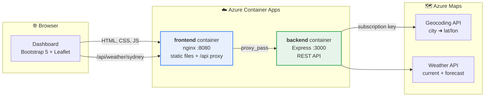
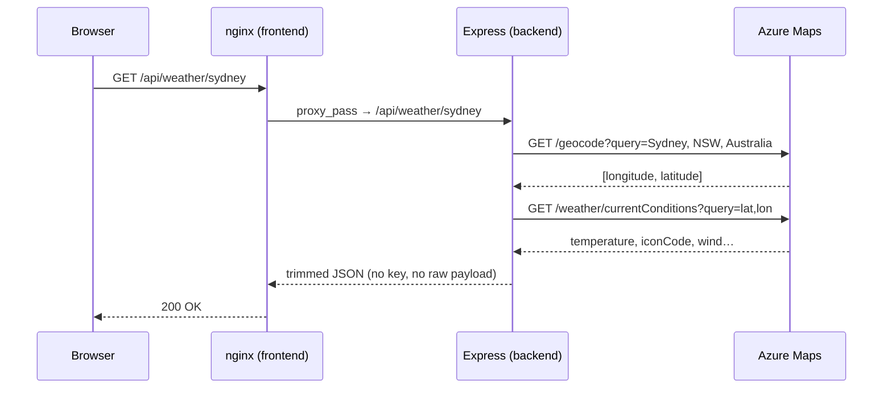
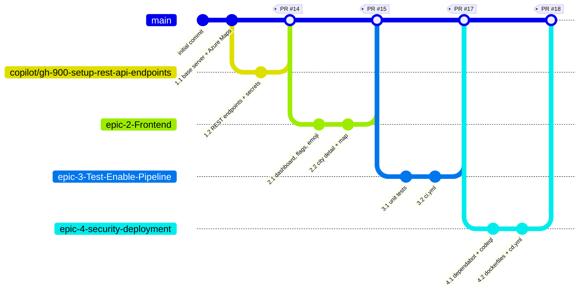
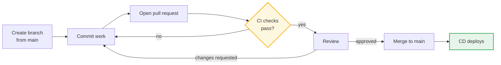
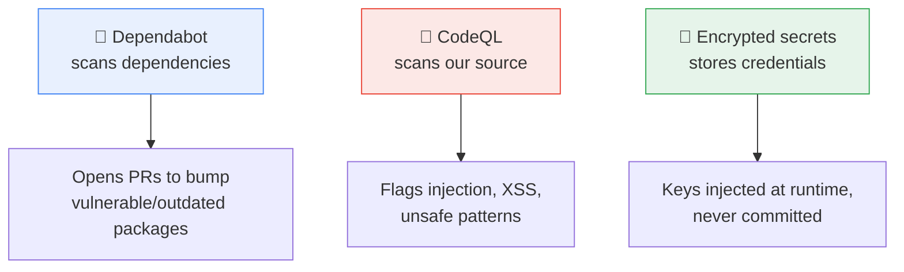
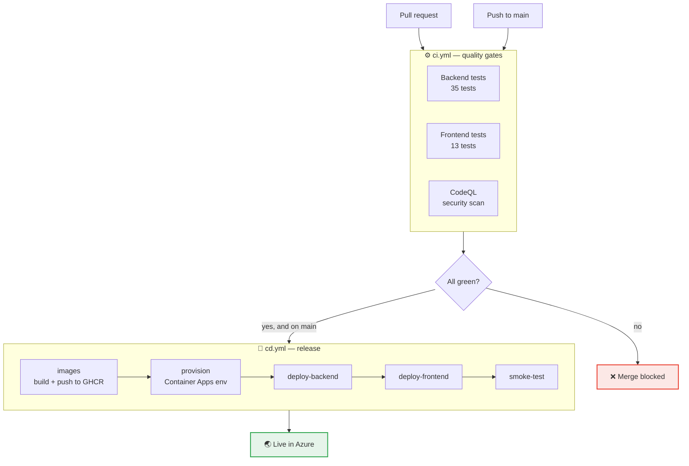

# GH-900 · DevOps & GitHub Foundations Notes

A working sample application used to teach GitHub end to end: **issues → branches → pull requests →
automated checks → security scanning → deployment.**

Everything described here is real and live in this repository — the screenshots, PR numbers and URLs
are not made up. Read this top to bottom and you will have seen a complete DevOps loop.

> ### 📚 Class recaps
>
> | | Covers |
> | --- | --- |
> | **[Day 1 Recap](Day1-Recap.md)** | Git vs GitHub, repositories, branches, issues, Organizations, Projects, Copilot, security basics |
> | **[Day 2 Recap](Day2-Recap.md)** | Open source & InnerSource, CodeQL, Dependabot, secret scanning, authentication, Actions, exam focus |
>
> The recaps are the *concepts*. This README is those concepts *applied* to a real application.

---

## Contents

1. [What you will learn](#1-what-you-will-learn)
2. [The application](#2-the-application)
3. [Run it yourself](#3-run-it-yourself)
4. [Working in GitHub](#4-working-in-github) — repo, issues, branches, PRs, projects
5. [Security](#5-security)
6. [The pipeline (CI/CD)](#6-the-pipeline-cicd)
7. [Reference](#7-reference)

---

## 1. What you will learn

| GitHub concept | Where you can see it in this repo |
| --- | --- |
| **Repository** | Code, README, history, settings — the unit everything else hangs off |
| **Issues** | Epics `#2 #5 #8 #11` broken into Sub-Tasks `#3 #4 #6 #7 #9 #10 #12 #13` |
| **Branches** | One branch per Epic, e.g. `epic-2-Frontend`, `epic-4-security-deployment` |
| **Pull requests** | `#14 #15 #17 #18` — every change reached `main` through one |
| **Projects** | Board view of the Epics/Sub-Tasks above |
| **Actions** | `ci.yml` (tests + scan) and `cd.yml` (build + deploy) |
| **Rulesets / branch protection** | `main` cannot be pushed to directly; three checks must pass |
| **Security** | Dependabot, CodeQL, encrypted secrets |
| **Packages** | Two container images published to GitHub Container Registry |

---

## 2. The application

A weather dashboard showing current conditions for **7 cities across 5 countries** (Australia,
Singapore, India, The Philippines, South Africa). Click a city for a detail view with a map and a
5 / 7-day forecast. Light and dark themes.

### Architecture



**Why two containers, and why the proxy?** The browser only ever talks to the frontend. nginx serves
the page *and* forwards `/api/*` to the backend. Two consequences worth understanding:

- **The Azure Maps subscription key never reaches the browser.** Only the backend holds it. If the
  page called Azure Maps directly, anyone could open DevTools and steal the key.
- **No CORS to configure.** The page and the API share one origin, so the browser raises no
  cross-origin objection.

### Request flow



### Components

| Component | Technology | Responsibility |
| --- | --- | --- |
| `frontend/index.html`, `app.js`, `styles.css` | Bootstrap 5, Leaflet | Rendering, hash routing (`#/city/<id>`), theme toggle |
| `frontend/nginx.conf.template` | nginx | Serves static files, proxies `/api` |
| `backend/src/routes/` | Express | HTTP layer, input validation |
| `backend/src/services/` | Node | Azure Maps calls, response mapping |
| `backend/src/config/` | Node | Env parsing, the supported-city allowlist |

> **Security detail:** the city in the URL is matched against an allowlist. User input is never
> forwarded to Azure Maps, which prevents a caller from steering our server at arbitrary URLs
> (server-side request forgery).

---

## 3. Run it yourself

**Prerequisites:** Node.js 24+, and an Azure Maps account key
(*Azure portal → your Azure Maps account → Authentication → Primary Key*).

```powershell
git clone https://github.com/GH-900-trainings/GH-900-Sep-2026.git
cd GH-900-Sep-2026
npm run install:all

cd backend
Copy-Item .env.example .env     # macOS/Linux: cp .env.example .env
# open .env and set AZURE_MAPS_KEY=<your key>
cd ..

npm start                        # http://localhost:3000
```

Locally the backend serves the dashboard itself, so you only run one process. In Azure they are two
containers — that is the only difference between the two setups.

```powershell
npm test              # all 48 tests: 35 backend + 13 frontend
npm run test:backend
npm run test:frontend
```

The tests stub every outbound call, so **they need no network and no Azure Maps key.**

> The server refuses to start without `AZURE_MAPS_KEY`. That is deliberate — failing loudly at
> startup beats a confusing 500 on the first request. `.env` is gitignored, so a real key can never
> be committed.

---

## 4. Working in GitHub

### 4.1 Issues — planning the work

Work is described *before* it is written. This repo uses two levels:

- **Epic** — a big outcome, e.g. `#5 [Epic 2] Frontend - Country & City Weather Dashboard`
- **Sub-Task** — one shippable slice, e.g. `#6 Sub-Task 2.1: Dashboard - Bootstrap UI, Flags & Emoji Weather`

Each Sub-Task carries **acceptance criteria** — a checklist that defines "done". This is what makes a
pull request reviewable: a reviewer checks the code against the criteria instead of guessing intent.

### 4.2 Branches — where the work happens

`main` is always deployable. Nobody commits to it directly. Each Epic gets a branch, work happens
there, and it returns through a pull request.



Read that diagram as: **the blue line is always releasable; the coloured lines are work in progress.**
A branch is cheap and isolated — you can break things on it without breaking anyone else.

### 4.3 Pull requests — how work gets reviewed and merged

A pull request says "please merge this branch into `main`". It is where review, discussion and the
automated checks all meet.



### 4.4 Rulesets — enforcing the process

Good intentions are not a process. The `protect-the-main-branch` **ruleset** makes the rules
mechanical:

| Rule | Effect |
| --- | --- |
| Pull request required | No direct pushes to `main` |
| Required status checks | `Backend tests`, `Frontend tests`, `Analyze (javascript-typescript)` must be green |
| Block force pushes | History cannot be rewritten |
| Block deletion | `main` cannot be deleted |

> The required check names are the **job names** in `ci.yml`. Rename a job and the gate silently
> waits forever for a check that no longer exists.

### 4.5 Projects — seeing the whole board

GitHub **Projects** turns the issues above into a board (Todo / In progress / Done) or a table with
custom fields like size and iteration. Issues and PRs stay the single source of truth; the Project is
a *view* over them, so moving a card never loses the discussion attached to the issue.

---

## 5. Security

Three different layers, each catching something the others cannot.



**Dependabot** (`.github/dependabot.yml`) checks `backend/` and `frontend/` weekly. It is already
working — see open PRs **#19, #20, #21** bumping `express`, `dotenv` and `jsdom`. Each one runs the
full CI suite, so you can see immediately whether the upgrade breaks anything.

**CodeQL** is the `analyze` job in `ci.yml`. It builds a queryable database of the code and hunts for
vulnerability patterns on every push and PR, plus weekly.

**Secrets** are encrypted repository settings, write-only — once saved, nobody can read them back,
and Actions masks them in logs.

| Secret | Used by | Purpose |
| --- | --- | --- |
| `AZURE_MAPS_KEY` | CI + CD | Azure Maps subscription key |
| `AZURE_CREDENTIALS` | CD | Service principal that deploys to Azure |

> **The golden rule: a secret never lands in git.** Not in code, not in a config file, not in a
> commit "temporarily". Git history is forever — removing it later does not un-leak it.

---

## 6. The pipeline (CI/CD)

**Continuous Integration (CI)** — every change is automatically built and tested, so problems are
found in minutes rather than at release time.

**Continuous Deployment (CD)** — a change that passes everything is automatically released, so
shipping is routine instead of an event.



### Why two workflow files?

`needs:` — the keyword that makes one job wait for another — **only works inside a single workflow
file.** Since deployment lives in `cd.yml`, it cannot `needs:` the test jobs in `ci.yml`. The link is
a `workflow_run` trigger instead: CD starts only when CI **completes successfully on `main`**. Inside
`cd.yml`, the five stages still chain with `needs:`.

### Things that will bite you

| Gotcha | What we did |
| --- | --- |
| In a `workflow_run`, `github.sha` is the branch head, **not** the commit that was tested | Carry `workflow_run.head_sha` through as `DEPLOY_SHA` |
| The weekly CodeQL run also "completes CI" and would redeploy | Only deploy when the CI run came from a `push` |
| Two deployments overlapping | A `concurrency` group that queues instead of cancelling |
| `ghcr.io` rejects uppercase image names (this repo has capitals!) | `docker/metadata-action` lowercases them |
| The deploy identity is scoped to one resource group | It cannot create the group; that is one-time manual setup |

### One-time setup (already done for this repo)

```powershell
# 1. Resource group + deployment identity. The pipe means the credential is written
#    straight into the GitHub secret and is never displayed or saved to disk.
az group create -n rg-gh900-weather -l southeastasia
$sub = az account show --query id -o tsv
az ad sp create-for-rbac --name gh900-weather-deploy --role contributor `
  --scopes "/subscriptions/$sub/resourceGroups/rg-gh900-weather" --json-auth |
  gh secret set AZURE_CREDENTIALS --repo <owner>/<repo>

# 2. The Azure Maps key
gh secret set AZURE_MAPS_KEY --repo <owner>/<repo>
```

After the first successful run, make both packages public:
*Repository → Packages → select package → Package settings → Change visibility → Public.*
Container Apps then pulls the images anonymously, with no registry credentials to manage.

---

## 7. Reference

### Endpoints

| Method | Path | Description |
| --- | --- | --- |
| GET | `/health` | Liveness check |
| GET | `/api/cities` | Supported cities with flag, coordinates, time zone |
| GET | `/api/weather` | Current weather for every supported city |
| GET | `/api/weather/:city` | Current weather for one city |
| GET | `/api/forecast/:city?days=1-10` | Daily forecast (defaults to 5) |

```bash
curl http://localhost:3000/api/cities
curl http://localhost:3000/api/weather/sydney
curl "http://localhost:3000/api/forecast/mumbai?days=7"
```

Supported city ids: `sydney`, `melbourne`, `singapore`, `mumbai`, `new-delhi`, `manila`, `cape-town`.
An unknown id returns `404` with the list of valid ids.

### Configuration

| Variable | Required | Default | Purpose |
| --- | --- | --- | --- |
| `AZURE_MAPS_KEY` | yes | — | Azure Maps subscription key |
| `PORT` | no | `3000` | Local listen port |
| `WEATHER_UNITS` | no | `metric` | `metric` or `imperial` |
| `HTTP_TIMEOUT_MS` | no | `8000` | Per-call timeout to Azure Maps |

### Project layout

```
.github/
  workflows/ci.yml     tests + CodeQL
  workflows/cd.yml     build images + deploy to Azure
  dependabot.yml       weekly dependency updates
backend/
  src/config/          env parsing + supported-city allowlist
  src/services/        Azure Maps client, geocoding, weather, forecast
  src/routes/          health, cities, weather, forecast
  src/app.js           Express app (no listen, so tests can import it)
  test/                35 tests, stubbed fetch
  Dockerfile           node:24-alpine, runs as non-root
frontend/
  index.html app.js styles.css
  nginx.conf.template  static files + /api proxy
  test/                13 jsdom tests
  Dockerfile           nginx:1.27-alpine
```

### Glossary

| Term | Meaning |
| --- | --- |
| **Branch** | An isolated line of work; cheap to create, safe to break |
| **Pull request** | A request to merge a branch, plus review and checks |
| **Workflow** | An automation file in `.github/workflows/` |
| **Job / step** | A workflow runs jobs; a job runs steps. Jobs can run in parallel |
| **Runner** | The machine executing a job (here, GitHub-hosted `ubuntu-latest`) |
| **Artifact / image** | The packaged output; here, container images in GHCR |
| **Secret** | Encrypted, write-only configuration injected at runtime |
| **Ruleset** | Enforced rules on a branch, e.g. required checks |
